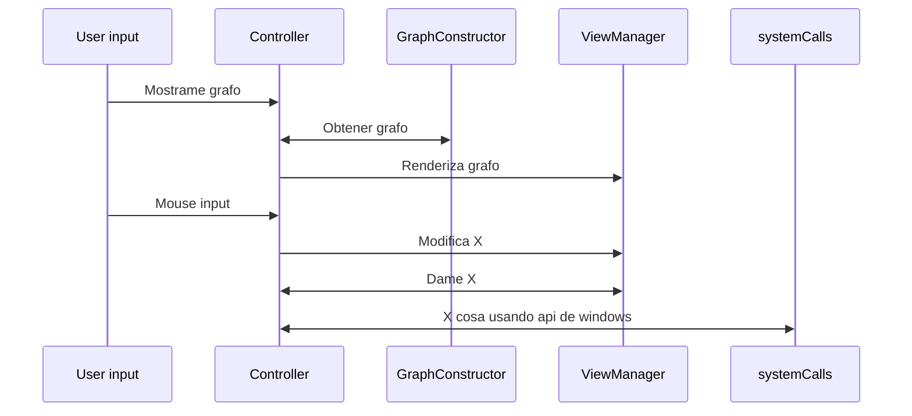

```mermaid
sequenceDiagram
    User input->>Controller:Mostrame grafo
    
    Controller<<->>GraphConstructor: Obtener grafo
    
    Controller->>ViewManager: Renderiza grafo
    
    User input->>Controller: Mouse input

    Controller->>ViewManager: Modifica X
    Controller<<->>ViewManager: Dame X

    Controller<<->>systemCalls: X cosa usando api de windows
    

```