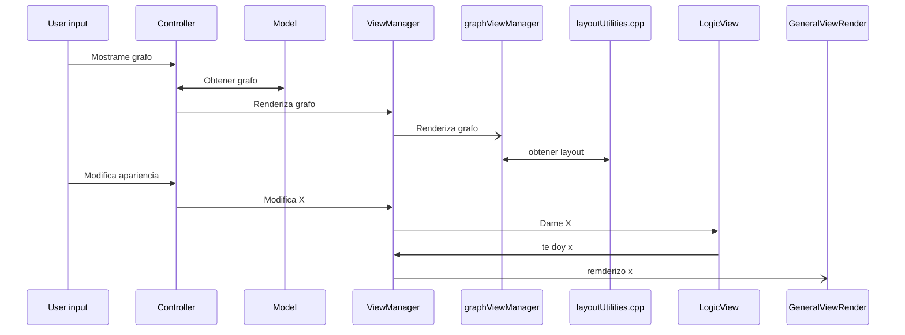

```mermaid
sequenceDiagram
    User input->>Controller:Mostrame grafo
    Controller<<->>Model: Obtener grafo
    
    Controller->>ViewManager: Renderiza grafo
    ViewManager-)graphViewManager: Renderiza grafo
    graphViewManager<<->>layoutUtilities.cpp: obtener layout
    
    


    User input->>Controller: Modifica apariencia
    Controller->>ViewManager: Modifica X
    ViewManager->>LogicView: Dame X
    LogicView->>ViewManager: te doy x
    ViewManager-)GeneralViewRender: remderizo x
```